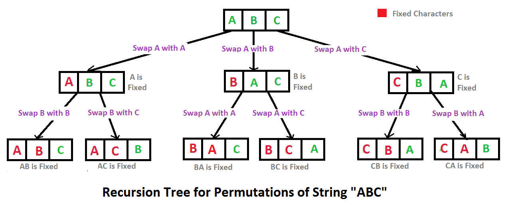

# Permutation With Swap Method

A Permutation method that utilizes recursion and a swap method to show all the possible combinations in Java.

Source: https://www.geeksforgeeks.org/java-program-to-print-all-permutations-of-a-given-string/#
